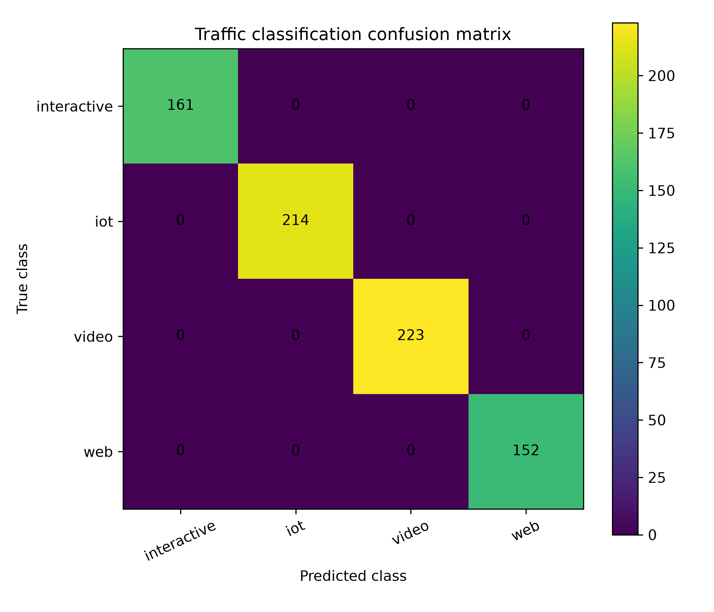
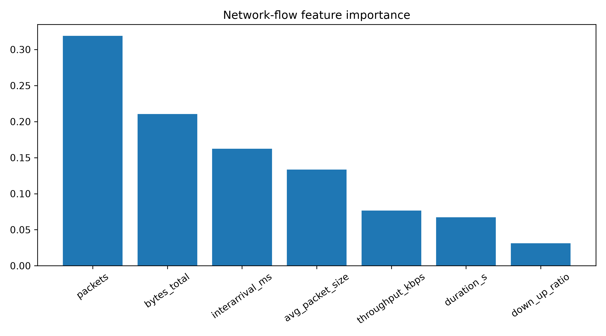

# Network Traffic Analysis with Machine Learning

A Machine Learning project for classifying synthetic network-flow records into traffic classes: **IoT**, **video**, **interactive** and **web**.

The project is suitable for a Data Scientist / ML Engineer portfolio because it combines telecom context, feature engineering, model training, evaluation metrics, confusion matrix visualization, Docker and CI.

## Problem

In 5G networks, traffic classification can support network slicing decisions. Different applications require different resource profiles:

- IoT: low bandwidth, many small flows;
- video: high throughput and long sessions;
- interactive: low latency and frequent packet exchange;
- web: mixed traffic.

## What is implemented

- Synthetic flow generator with realistic network-flow features.
- Features: duration, packets, bytes, average packet size, interarrival time, down/up ratio and throughput.
- Random Forest classifier.
- Accuracy and macro-F1 evaluation.
- Classification report.
- Confusion matrix plot.
- Feature importance plot.
- Automated tests and Docker support.

## Quick start

```bash
python -m venv .venv
source .venv/bin/activate  # Windows: .venv\Scripts\activate
pip install -r requirements.txt
pip install -e .
python scripts/run_experiment.py
```

Results are saved in `results/`:

```text
synthetic_network_flows.csv
classification_metrics.csv
classification_report.txt
confusion_matrix.csv
confusion_matrix.png
feature_importance.csv
feature_importance.png
```

## Docker

```bash
docker build -t network-traffic-analysis-ml .
docker run --rm network-traffic-analysis-ml
```

## Portfolio summary

This project demonstrates supervised learning, telecom traffic analytics, feature engineering, model evaluation and reproducible ML workflow.

## Future improvements

- Use real packet/flow data from Wireshark or CIC datasets.
- Add XGBoost/LightGBM comparison.
- Add anomaly detection for suspicious traffic.
- Export the classifier as a small API with FastAPI.

## Results preview

This experiment classifies synthetic network traffic flows into several traffic categories using feature engineering and a Random Forest classifier.

### Classification metrics

| Metric | Value |
|---|---:|
| Accuracy | 1.000 |
| Macro F1-score | 1.000 |

The dataset is synthetic and intentionally structured to demonstrate a clean and reproducible machine learning pipeline.  
Future versions can be extended with real packet captures, Wireshark exports or public network traffic datasets.

### Confusion matrix



### Feature importance



